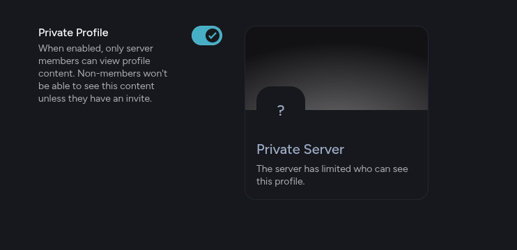
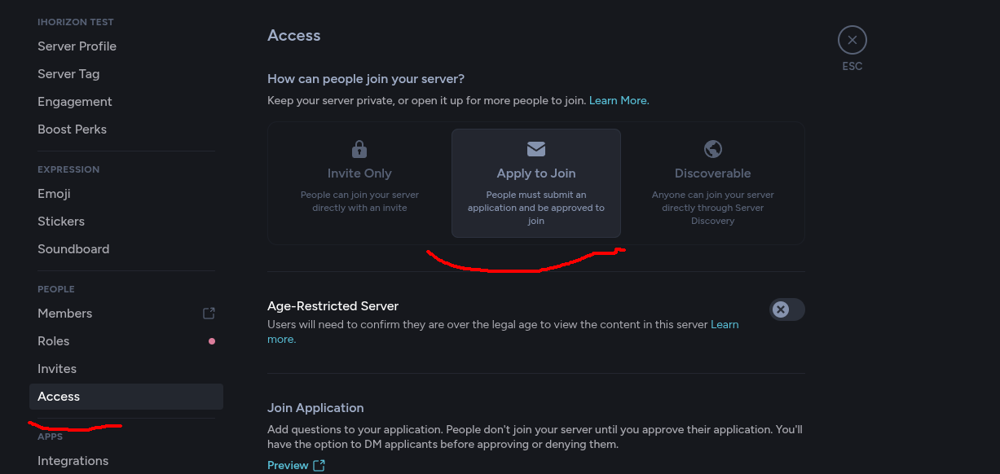

# SearchHubDiscordTokensFinder

# Explication

Ce repositories GitHub permet de détecter et de bannir les tokens discord de [SearchHub](https://searchhub.vip) sur votre serveur discord. 

En effet, vous êtes sensé savoir que discord est maintenant une terre hostile à la confidentialité de votre vie privée. Ne serait-ce la plate-forme qui elle même log absolument toute activité et qui vous empêche même, ilégalement de vous laissez supprimer vos messages [source](https://github.com/victornpb/undiscord/discussions/429).

Et même maintenant, où les utilisateurs de la plateforme indèxe, sauvegarde, traque vos moindres fait-et-gestes au seins de serveur discord publique. C'est devenue monnaie courrante de voir des plateformes complètement ilégal comme SearchHub d'apparaître, et contre une maudite somme d'argent telle que 5€, pouvoir avoir accès à tant d'informations personnelle sur n'importe qui, si précieuse soit-t'elle.

## Il faut pouvoir dire stop!

Pourquoi ce laissez faire? Hein, sérieusement, il faut savoir dire non à ce genre de choses. Cela devrait nous choquer, nous choquer de voir que maintenant, des personnes lambdas ai l'accès à votre intimité préciseuse-soit-t'elle dans leur infrastructure ilégal.

# le combat

Je sais que je combat à mains nue face à la puissance redoutable de leur industrie. mais si vous, vous aussi, vous en avez marre que votre vie privée, vos messages, votre liberté soit réprimée par des personnes qui difusent au grand publique vos moindres messages. Alors oui, le combat est légitime. 

# comment lutter efficacement

Il n'y as pas vraiment de moyen possible pour lutter (À GRANDE ÉCHELLE). SearchHub, comme tant d'autres, indèxe vos serveurs d'une manière très efficace.

Regarde les discovery, inspecte les status des gens sur des serveurs publique pour trouver des status avec des liens d'invitation, y fait rejoindre des tokens, puis récursivement re-inspecte les bios....

cette méchanique est industriel.

Alors comment lutter, comment contrer ces attaques massive contre votre droit le plus fondamental, celui d'avoir une vie privée?

c'est pour cela que ce repositories github existe.

# Filtrer à l'entrer les comptes discord qui rejoins votre serveur

Comme je l'ai dis en haut, l'arrivées de token sur votre serveur discord est une évidante réalité. Pour les bloquer, il vas falloir passez votre serveur discord en "Apply to Join"

Déjà commencer par mettre votre serveur en profil privée, cela empêchera SearchHub d'indexer votre serveur via les emojis, ou les tags discord

Ensuite, voilà où il faudras allez pour activer le "Apply To Join"

Le apply to join est un système sous forme de question personalisable que vous pourrais demander au nouveau arrivant. Il seront placer dans une fil d'attente, et ne seront pas sur le serveur discord en attendant. Il n'auront pas l'accès aux messages et contenue privée du serveur. Bien évidèment il pourrons très bien répondre aux réponses si leur programme est bien dévelopée, c'est pour cela que vous pourrais inspecter leur profil. (Date de création de compte trop récente, photo de profil récurante, bio trop "robotisé", les connections, etc). Vous pouvez même créer un groupe avec le membre pour lui poser plus de questions si vous avez des doutes

# Trouver et éliminer les tokens

Nous voilà au plat de résistance ! ce repositories github vas vous permettre de troué le cul à ces batards... De bannir les tokens discord se trouvant dans votre serveur. Comment fonctionne ce programme?
Très simple, voici une explication:

[explication](./EXPLAIN_THE_SOFT.md)