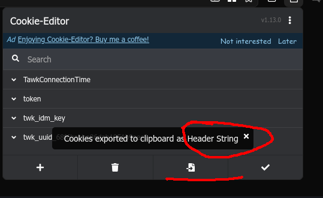
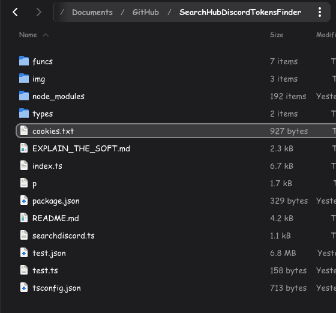
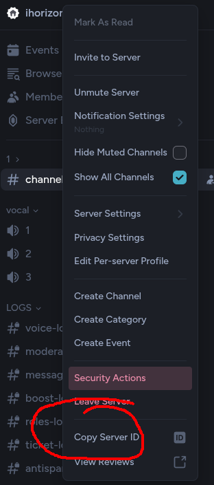

<p align="center">
  
</p>

# ENGLISH VERSION AT [CLICK HERE](./ENGLISH.README.MD)

# SearchHubDiscordTokensFinder - Don't be mad SearchHub

# Explication

Ce **repository** GitHub permet de détecter et de bannir les tokens Discord de [SearchHub](https://searchhub.vip) sur votre serveur Discord.

En effet, vous êtes censé savoir que Discord est maintenant une terre hostile à la confidentialité de votre vie privée. Ne serait-ce la plateforme qui elle-même log absolument toute activité et qui vous empêche même, illégalement, de vous laisser supprimer vos messages [source](https://github.com/victornpb/undiscord/discussions/429).

Et même maintenant, où les utilisateurs de la plateforme indexent, sauvegardent, traquent vos moindres faits-et-gestes au sein de serveurs Discord publics. C’est devenu monnaie courante de voir des plateformes complètement illégales comme SearchHub apparaître, et contre une maudite somme d’argent telle que 5€, pouvoir avoir accès à tant d’informations personnelles sur n’importe qui, si précieuses soient-elles.

## Il faut pouvoir dire stop !

Pourquoi se laisser faire ? Hein, sérieusement, il faut savoir dire non à ce genre de choses. Cela devrait nous choquer, nous choquer de voir que maintenant, des personnes lambda aient accès à votre intimité, précieuse soit-elle, dans leur infrastructure illégale.

# Le combat

Je sais que je combats à mains nues face à la puissance redoutable de leur industrie. Mais si vous aussi, vous en avez marre que votre vie privée, vos messages, votre liberté soient réprimés par des personnes qui diffusent au grand public vos moindres messages… alors oui, le combat est légitime.

# Comment lutter efficacement

Il n’y a pas vraiment de moyen possible pour lutter (À GRANDE ÉCHELLE). SearchHub, comme tant d’autres, indexe vos serveurs d’une manière très efficace.

Regarde les discovery, inspecte les statuts des gens sur des serveurs publics pour trouver des statuts avec des liens d’invitation, y fait rejoindre des tokens, puis récursivement ré-inspecte les bios…

Cette mécanique est industrielle.

Alors comment lutter, comment contrer ces attaques massives contre votre droit le plus fondamental, celui d’avoir une vie privée ?

C’est pour cela que ce **repository** GitHub existe.

# Filtrer à l’entrée les comptes Discord qui rejoignent votre serveur

Comme je l’ai dit en haut, l’arrivée de tokens sur votre serveur Discord est une évidente réalité. Pour les bloquer, il va falloir passer votre serveur Discord en “Apply to Join”.

Déjà commencer par mettre votre serveur en profil privé, cela empêchera SearchHub d’indexer votre serveur via les emojis ou les tags Discord.


Ensuite, voilà où il faudra aller pour activer le “Apply To Join” :


Le Apply To Join est un système sous forme de questions personnalisables que vous pourrez demander aux nouveaux arrivants. Ils seront placés dans une file d’attente, et ne seront pas sur le serveur Discord en attendant. Ils n’auront pas accès aux messages et contenus privés du serveur. Bien évidemment, ils pourront très bien répondre aux questions si leur programme est bien développé, c’est pour cela que vous pourrez inspecter leur profil (date de création de compte trop récente, photo de profil récurrente, bio trop “robotisée”, les connexions, etc). Vous pouvez même créer un groupe avec le membre pour lui poser plus de questions si vous avez des doutes.

# Trouver et éliminer les tokens

Nous voilà au plat de résistance ! Ce **repository** GitHub va vous permettre de trouer le cul à ces bâtards… De bannir les tokens Discord se trouvant dans votre serveur. Comment fonctionne ce programme ?
Très simple, voici une explication :

[explication](./EXPLAIN_THE_SOFT.md)

# Prêt à vous battre ? Let's go

Bon, pour vous battre contre eux, va falloir les engraisser un peu. Il va vous falloir l’accès à leur service pour avoir accès à leur API pour déduire le token sur votre serveur. Je vous laisse trouver comment faire pour payer !

## Étape numéro 2 — récupérer vos cookies de session sur le site de SearchHub

Sur Firefox :

Exemple :


https://addons.mozilla.org/en-US/firefox/addon/cookie-editor/?utm_campaign=external-cookie-editor.com

Ensuite, avec vos cookies dans le presse-papier, créez un fichier appelé `cookies.txt` dans la racine du dossier.

Tel que :



## Étape numéro 3 — commencer la configuration du fichier d’environnement

Renommer `.env.example` en `.env`.

Dans le .env :

```env
GUILD_ID="ID DU SERVEUR"
TOKEN="TOKEN DU BOT"
SELFBOT_TOKEN="TOKEN DE VOTRE COMPTE DISCORD"
```

* Copier l’identifiant de votre serveur
  
  Si vous n’avez pas le bouton “Copy Server ID”, allez dans : paramètres utilisateur > Advanced / Paramètres avancés > Mode développeur > Activez-le.

* Récupérer le token d’un bot — ALLEZ VOIR [CETTE DOCUMENTATION](https://docs.ihorizon.org/token-setup/create-token/)

* Récupérer le token de votre compte Discord — [CETTE DOCUMENTATION](https://gist.github.com/MarvNC/e601f3603df22f36ebd3102c501116c6)

Il est nécessaire d’avoir du bon sens, et de savoir utiliser un peu un ordinateur avant de faire ceci.

### Étape numéro 4 — installer le Runtime BunJS pour lancer le programme

J’utilise BUN en développement, mon code contient des fonctions utilisables seulement avec Bun. Donc pas de NodeJS.

[Vous trouverez un tutoriel simple pour l’installation de Bun ici](https://bun.sh/)

# Puis voilà, suffit de lire le terminal

Cela prend du temps : plus vous avez de membres sur votre serveur Discord, plus ça sera long.
